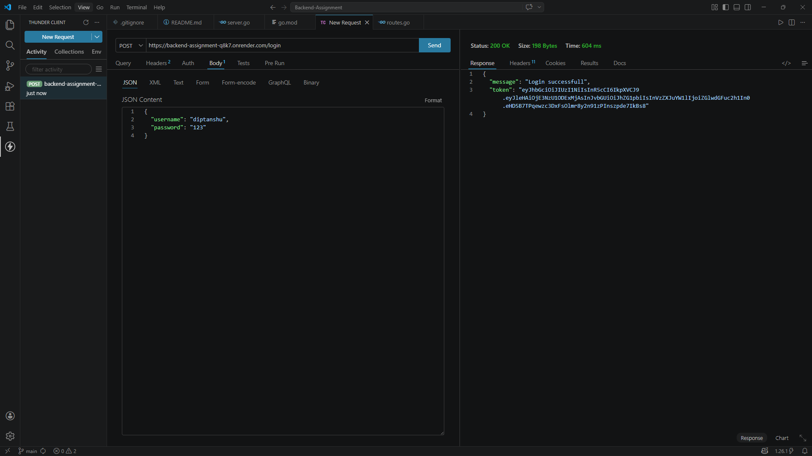
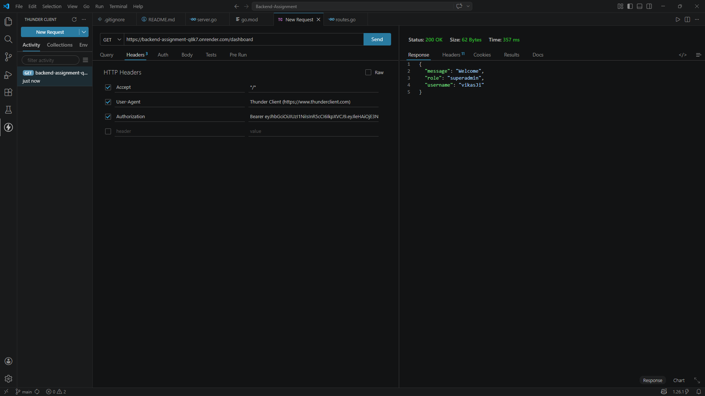
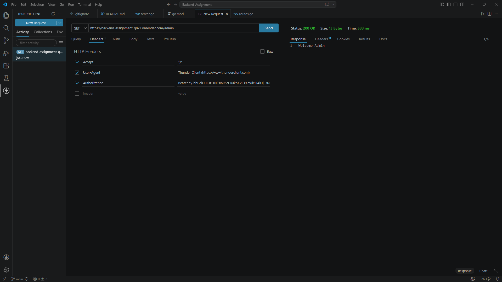
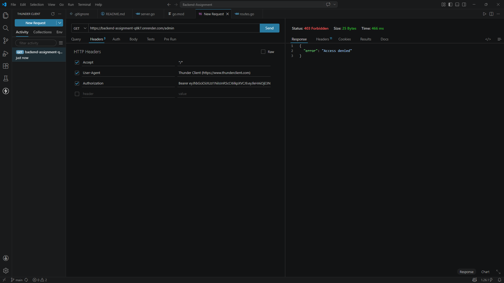

# 🔐 Go Fiber Authentication System (JWT + RBAC)

A backend authentication system built using **Golang (Fiber)** implementing **JWT-based authentication** and **Role-Based Access Control (RBAC)**.

---

## 🚀 Tech Stack

* Golang
* Fiber
* JWT

---

## 📁 Project Structure

```
Backend-Assignment/
│
├── server.go
├── go.mod
│
├── src/
│   ├── app.go
│   ├── routes.go
│   ├── controllers.go
│   ├── models.go
│   ├── middleware.go
│
├── screenshots/
└── README.md
```

---

## 👥 Demo Users

| Username  | Role       |
| --------- | ---------- |
| vikasJi   | superadmin |
| diptanshu | admin      |
| ashwin    | teacher    |
| student1  | student    |

---

## 🔑 API Endpoints

### 🔐 Login

**POST** `/login`

**Request Body:**

```json
{
  "username": "vikasJi",
  "password": "123"
}
```

**Response:**

```json
{
  "message": "Login successful",
  "token": "JWT_TOKEN"
}
```

---

## 🔒 Protected Routes

| Route      | Access            |
| ---------- | ----------------- |
| /dashboard | Any authenticated |
| /admin     | admin, superadmin |
| /teacher   | teacher           |
| /student   | student           |

---

## 🔐 Authorization Header

```
Authorization: Bearer <JWT_TOKEN>
```

---

## 🔄 Request Flow

1. User sends login request
2. Server validates credentials
3. JWT token is generated (username, role, expiry)
4. Token is sent in Authorization header
5. AuthMiddleware verifies token and extracts claims
6. RoleMiddleware checks access permissions
7. Response is returned

---

## ▶️ Run Locally

```
go run server.go
```

Server runs at:

```
http://localhost:3000
```

---

## 🌐 Live API

https://backend-assignment-q8k7.onrender.com

---

## 📸 API Testing Screenshots

### 🔐 1. Login (Admin User)



---

### 🔐 2. Login (Superadmin User)


---

### 🔓 3. Access Protected Route (/dashboard)



---

### 👑 4. Admin Route Access



---

### 🎓 5. Student Login


---

### ❌ 6. Unauthorized Access (Wrong Role)



---

## ⚠️ Limitations

* No database (uses in-memory map)
* No password hashing
* No refresh tokens

---

## 🚀 Future Improvements

* MongoDB/PostgreSQL integration
* Password hashing using bcrypt
* Refresh token implementation
* Environment-based configuration

---

## 👨‍💻 Author

**Diptanshu Vishwa**
Backend & Full Stack Developer
